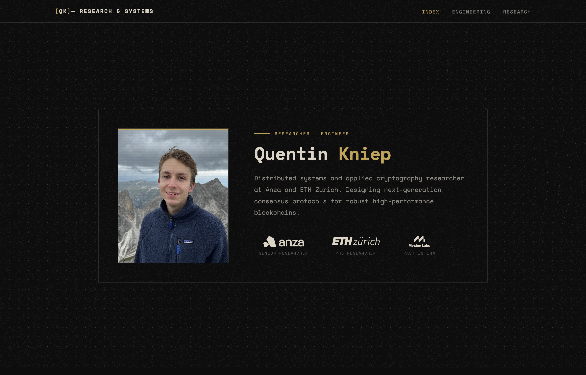

# Quentin Kniep — Portfolio Website

Static portfolio website for Quentin Kniep (distributed systems researcher at Anza, PhD at ETH Zurich).

<a target="_blank" href="https://quentinkniep.com"></a>

## Structure

```
├── index.html        # Homepage
├── research.html     # Research papers listing
├── engineering.html  # Projects listing
├── research/         # Paper detail pages (14)
├── engineering/      # Project detail pages (5)
├── css/style.css     # Retro-futuristic industrial theme
├── js/               # Visual effects (grain, dots)
└── favicon.svg       # [QK] logo
```

## Development

No build system — edit HTML directly. Open `index.html` in a browser to view.

## License

MIT License — see [LICENSE](LICENSE).
